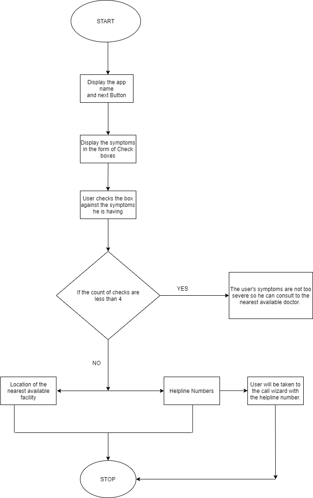

# Quick-Rescue
An app for solving the pandemic COVID-19.
DESCRIPTION
The main aspect of our idea is to overcome the panic situation among  people due to COVID-19 as they mistakenly consider even a common cold or flu to Corona and thereby create unnecessary burden over the health workers.Our app will help to guide people and get clarification of their symptoms over the phone call or an appointment with the nearby doctor.This will reduce the pressure on the doctors treating corona patients.
The major symptoms of corono virus so far discovered are-
1. Dry Cough
2. Fever
3. Difficulty in Breathing
4. fatigue
In this app the severity of the symptoms play the key role in determining the chances of a person having the symptons of corona virus.
We have provided four checkboxes, the user need to check against the respective symptom he/she is suffering from and the count of the checked box will give rise to two situations--
1. If the count is less than 4,then we consider the symptoms are not too severe and a solution is provided accordingly.
2. If the count equals to 4 i.e., the user is suffering from all the symptoms,then the severity is considered to be high and the user      will get two options.
In the first case, the user will be directed to the page displaying the message that the symptoms are not severe and containing the link to the pre existing services such as practo, GroAyu etc.,hence providing a means to the user to contact to the nearest doctor and getting the confirmed information.
In the second case of all the symptoms been checked the user will be directed to the page displaying two options--
1. To talk to the User's Local Government Helpline.
2. To see the nearest available facility for COVID-19 treatment.
If the user chooses the 1st option, then the hepline numbers of all the states and union territories will be displayed in the form of a list , as soon as the user selects a state the respective helpline number will be copied to their dialpad and the user will be able to contact the respective authority and in case of high severity can be isolated as soon as posible.
If the user chooses the 2nd option, then the location of nearest avialable facility will be shown to the user.So,the user can visit the hospital and get treated as soon as possible.
HARDWARE REQUIREMENTS:-
1.A working android phone. 
2.internet facility available.
3.The mobile phone should have a GPS.
SOFTWARE REQUIREMENTS:-
1.ANDROID version 4.1.1 Jelly Bean and above
2.Google Play Services(latest version)
 Process Flow:- 

 
